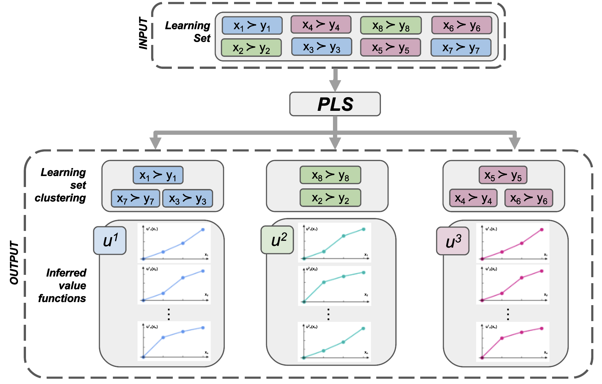

<div align="center">

# Learning multiple multicriteria additive models from heterogeneous preferences


Vincent Auriau<sup>1, 2</sup>, Khaled Belahcène<sup>1</sup>, Emmanuel Malherbe<sup>2</sup>, Vincent Mousseau<sup>1</sup> <br>
<sup>1</sup> <sub>*MICS* - CentraleSupélec,</sub> <sup>2</sup> <sub> Artefact Research Center </sub> <br>

In ADT 2024. <br>
[[Full Paper]]()  [[Appendices]](./doc/supplementary_material.pdf)  [[Oral Presentation]]()<br>

</div>

<p align="center"></p>

> **Abstract:** *Additive preference representation is standard in Multiple Criteria Decision Analysis, and learning such a preference model dates back from the UTA method. In this seminal work, an additive piece-wise linear model is inferred from a learning set composed of pairwise comparisons. In this setting, the learning set is provided by a single Decision-Maker (DM), and an additive model is inferred to match the learning set. We extend this framework to the case where (i) multiple DMs with heterogeneous preferences provide part of the learning set, and (ii) the learning set is provided as a whole without knowing which DM expressed each pairwise comparison. Hence, the problem amounts to inferring a preference model for each DM and simultaneously ``discovering'' the segmentation of the learning set. In this paper, we show that this problem is computationally difficult. We propose a mathematical programming based resolution approach to solve this Preference Learning and Segmentation problem (PLS). We also propose a heuristic to deal with large datasets. We study the performance of both algorithms through experiments using synthetic and real data.*

## Installation
Clone this repository:

```bash
git clone https://github.com/artefactory/learning-heterogeneous-preferences.git
```

Install the dependencies:
```bash
cd learning-heterogeneous-preferences
pip install -r requirements.txt
```

## Synthetic Experiments

In order to run the experiments with synthetic data you can use the following command:

```bash
python run_synthetic_experiments save_xps --base_dir synthetic_xp --repetitions 4 --n_clusters 2 3 4 \
--n_criteria 6 --learning_set_size 128 1024 --error 0 5
```

It will generate data with four different random seeds and compute the models (milo and heuristic) for all combinations of parameters. Data, models and results are saved in the directory `save_xps`: 
- n_clusters = [1, 2, 3]
- n_criteria=6
- learning_set_size=[128, 1024]
- error=[0, 5]

The notebook [notebooks/synthetic_results.ipynb](./notebooks/synthetic_results.ipynb) shows how to read and analyse the results.

## Real-Data Experiments

The stated preferences for car dataset used in the paper can be downloaded [here](https://github.com/artefactory/choice-learn/blob/main/choice_learn/datasets/data/car.csv.gz).
It is also part of the [choice-learn](https://pypi.org/project/choice-learn/) package that can be installed with `pip install choice-learn`.

Then, running the following command:

```bash
python run_cars_experiments save_xps --base_dir cars_xp --repetitions 4 --n_clusters 2 3 4 5 \
--learning_set_size 128 256 512
```

It will estimate the MILO and heuristic models with:
- learning_set_size=[128, 256, 512]
- 4 different random seeds for train/test split
- n_clusters=[2, 3, 4, 5]

The notebook [notebooks/cars_results.ipynb](./notebooks/cars_results.ipynb) shows how to read and analyse the results.

## Using the model on you own data


The different models can be used on your own data as follows:

```python
from python.models import UTA, ClusterUTA
from python.heuristics import Heuristic

model = ClusterUTA(
  n_pieces=5,
  n_clusters=3,
  epsilon=0.05
  )

history = model.fit(X, Y)

print(model.predict_utility(X))
````

All the models have lookalike signatures, in particular, in ```.fit(X, Y)```, X and Y must be the matrixes of same shape where:

- X[i] represents the features of alternative x_i
- Y[i] represents the features of alternative y_i
- x_i has been preferred to y_i

More details are given in the docstrings of the models if you want to better understand the different hyper-parameters.
The notebook [notebooks/train_on_other_data.ipynb](./notebooks/train_on_other_data.ipynb) also shows an example.

## License
This work is under the [MIT](./LICENSE) license.

## Citation
If you find this work useful for your research, please cite our paper:

```
@inproceedings{AuriauPLS:2024,
title={Learning multiple multicriteria additive models from heterogeneous preferences},
author={Auriau, Vincent and Belahcène, Khaled and Malherbe, Emmanuel and Mousseau, Vincent},
booktitle={Algorithmic Decision Theory},
year={2024},
}
```


<p align="center">
  <a href="https://www.artefact.com/data-consulting-transformation/artefact-research-center/">
    
  </a>
  &emsp;
  &emsp;
  <a href="https://mics.centralesupelec.fr/">
    
  </a>
  &emsp;
  &emsp;
  <a href="https://www.universite-paris-saclay.fr/">
    
  </a>
</p>
